# 2025: 12 Top-Tier AI-Powered Creative Analytics Tools You Must Know

Scrolling through ad manager dashboards trying to figure out which creatives actually drive sales feels like reading tea leaves. You see spend numbers, impressions, clicks—but connecting those metrics to specific creative elements that make ads convert requires hours of manual tagging, spreadsheet wrangling, and guesswork. AI-powered creative analytics platforms automate this entire workflow by analyzing your ads frame-by-frame, identifying winning patterns across formats and audiences, and telling you exactly what to test next based on your brand's actual performance data.

## **[Motion](https://motionapp.com)**

AI-powered creative intelligence revealing winning patterns before competitors do.

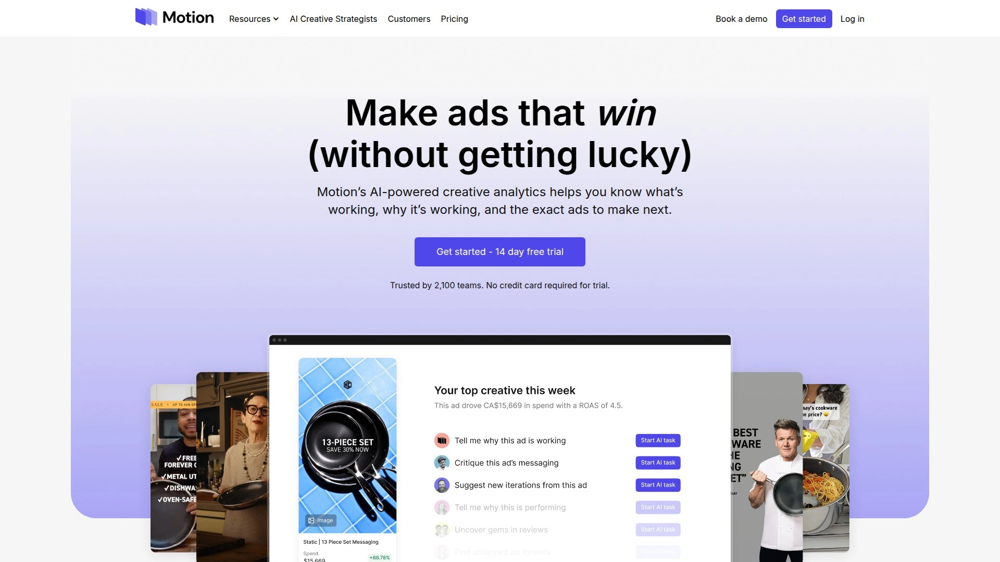

Motion analyzes your Meta, TikTok, YouTube, and LinkedIn ads automatically, grouping creatives together to show holistic performance patterns instead of isolated ad metrics. The platform examines videos frame-by-frame, cross-references performance across your account, and extracts clear patterns about which hooks, formats, and messaging actually drive revenue. Context-aware AI delivers recommendations based on your brand's unique wins and historical data rather than generic advice disconnected from your reality.

AI agents built by DTC legends like Jess Bachman and Barry Hott provide expert analysis of what's working, what needs fixing, and precise steps to improve ROAS while lowering acquisition costs. The competitor tracking agent monitors rival brands' latest ads and builds strategic plans to outperform them, turning competitive intelligence into actionable creative direction. Pre-launch analysis catches potential flops before they consume ad spend, training your team to recognize winning creative characteristics.

**Visual-first reporting** gets growth and creative teams aligned by showing assets alongside metrics, ending the disconnect where media buyers see numbers while designers see thumbnails. Automated reports pull creative assets and performance data into dashboards that update continuously without breaking, eliminating manual report building. Secure sharing lets you distribute live data with teams or clients while hiding sensitive information when working with freelancers or agencies.

Platform integrations enhance standard ad data with Northbeam attribution, Google Analytics 4 custom conversions, and third-party metrics like offline purchases or sales calls booked. Powerful filtering hunts down top creatives by naming conventions, product categories, custom conversions, and over 200 metrics. The platform particularly suits DTC brands managing significant ad spend where identifying creative patterns directly impacts bottom-line revenue.

## **[Foreplay](https://www.foreplay.co)**

Complete winning ad workflow combining creative research with performance reporting.

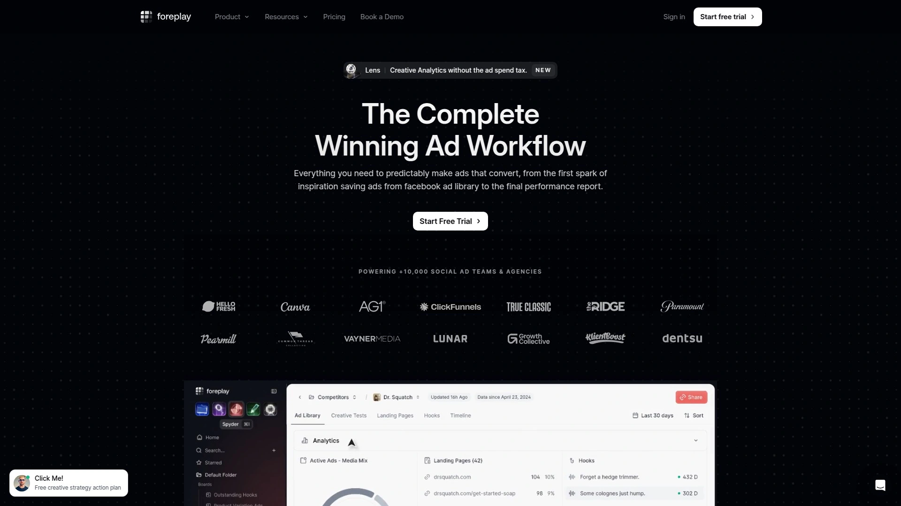

Foreplay delivers five products in one platform—ad saving, competitor tracking, creative analytics, brief building, and team collaboration tools that cover the entire creative workflow from inspiration to performance analysis. Save ads from Meta, TikTok, LinkedIn Ad Libraries, or anywhere online using the Chrome extension, building unlimited swipe files organized however your team thinks. Automatic competitor tracking monitors brands you follow, revealing their creative strategies and testing patterns without manual checking.

The ad search engine uses AI to query 12+ million ads from leading brands, helping you identify winning themes, hooks, and copy driving competitor success. Expert swipe files curated by industry specialists provide starting points based on proven strategies rather than guessing. Brief creation consolidates performance data, creative references, and specific recommendations into modular briefs that retain full context.

**Creative analytics** sync Meta, TikTok, YouTube, and LinkedIn data into visual reports comparing format performance, creator effectiveness, and messaging angles. MagicAI provides automated performance summaries and competitor activity digests, functioning as an always-on radar for what to make next. Mobile app access lets creative strategists work from anywhere, while API connectivity integrates data with other agent platforms.

Foreplay pricing offers self-serve plans with no contracts, unlimited ad spend tracking across accounts, and one-on-one onboarding for new teams. The platform particularly benefits agencies and brands needing both creative inspiration and performance tracking rather than analytics-only solutions.

## **[MagicBrief](https://magicbrief.com)**

Bridge between media buyers and creatives through visual performance insights.

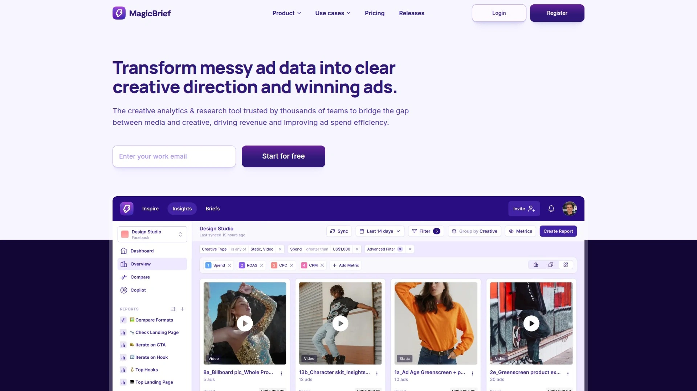

MagicBrief transforms complex ad data into actionable creative insights by identifying exact elements driving performance across campaigns. Visual reports create shared language both media teams and designers understand, accelerating approval cycles and production workflows. The platform compares performance across formats, creators, angles, and messaging to reveal what actually generates returns.

Creative research tools search millions of ads to uncover proven patterns in your industry, eliminating expensive blind testing. Real-time competitor tracking shows which creative elements drive their performance, letting you learn from their experiments without wasting your budget. MagicAI delivers automated summaries of your performance and competitor activity, benchmarking your creative against industry standards.

**Brief management** unifies performance data, references, and recommendations into one system that manages your entire content pipeline. Generate AI-optimized scripts informed by what already works rather than starting from scratch each time. Commenting and tagging keeps feedback loops moving by letting team members leave context directly on ads.

Integration with Meta, TikTok, YouTube, and LinkedIn centralizes performance tracking across channels. The platform analyzes billions in ad spend from thousands of teams, providing context about what works across the broader DTC landscape. MagicBrief suits teams wanting comprehensive creative workflow management beyond simple analytics dashboards.

## **[Superads](https://www.superads.ai)**

Free AI-powered creative analytics focusing entirely on your own ad performance.

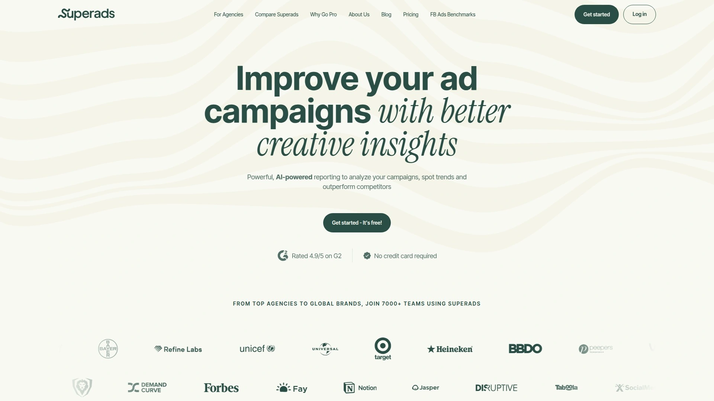

Superads provides deep creative analytics for your campaigns rather than tracking competitors, helping performance marketers understand which specific ads drive conversions. The platform automatically categorizes ads to identify winning products, value propositions, hooks, emotional triggers, copy variations, and ad types without manual tagging. AI Copilot lets you ask questions about data, get help editing reports, and receive recommendations based on historical performance.

Intuitive visualizations make performance metrics accessible to everyone from graphic designers to strategists, breaking down complex data into understandable views. Custom variables enable additional attribution tracking beyond standard metrics like spend, clicks, CTR, and cost-per-contact. Drag-and-drop interface creates shareable reports that communicate standard metrics, AI-analyzed dimensions, and custom tracking at a glance.

**Live interactive dashboards** adapt to each team's unique needs and communication styles, transforming how you interpret ad performance data. The platform represents a vast improvement over manual spreadsheets that only scale until growth demands better infrastructure. Future features will compare creative performance against industry benchmarks and reveal how your ads stack up competitively.

Superads positions as the essential next step after ad intelligence tools—once you know what competitors are doing, you need to optimize your own creative to outperform them. The platform focuses on moving teams from observation into action through continuous testing and iteration. Free access removes financial barriers for teams wanting advanced creative analytics.

## **[AdSkate](https://www.adskate.com)**

AI creative intelligence platform delivering insights five times faster than manual analysis.

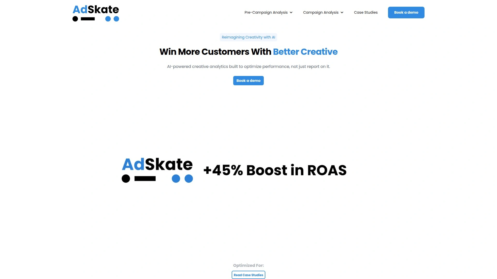

AdSkate uses AI to analyze creative performance before ads enter walled gardens like Google and Meta, optimizing campaigns through synthetic audiences and predictive modeling. The platform helps brands understand which creative elements resonate with target audiences, boosting ROAS by up to 45% through data-driven optimization. Creative insights reveal specific components driving results rather than generic performance summaries.

Analysis speed increases dramatically—teams extract actionable insights five times faster than manual approaches involving spreadsheets and ad manager exports. Revenue optimization focuses on maximizing return from existing spend rather than simply increasing budgets. The platform particularly suits brands managing substantial advertising budgets where creative effectiveness directly impacts profitability.

**AI-powered recommendations** guide next creative iterations with evidence-based suggestions tied to your specific performance data. The platform simplifies campaign optimization by surfacing opportunities buried in complex data sets. AdSkate aims to reimagine creativity through AI-enhanced workflows that maintain human judgment while leveraging machine insights.

Integration capabilities connect AdSkate data to broader marketing stacks and workflow tools. The platform benefits performance marketers tired of guessing which creative changes will improve results, providing clarity based on actual audience response patterns.

## **[VidMob](https://vidmob.com)**

Creative data platform combining production, analytics, and AI-powered insights.

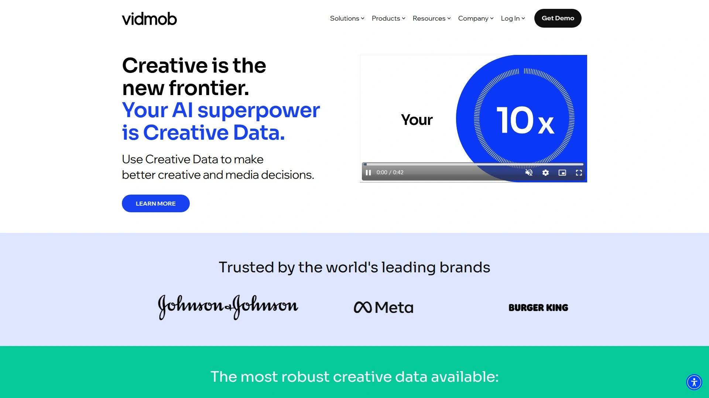

VidMob functions as comprehensive creative intelligence platform analyzing video and static creative to improve brand resonance and marketing performance. The company positions as "The Creative Data Company," using AI to understand audiences at scale while providing actionable recommendations for creative optimization. Platform capabilities span creative production services, analytics dashboards, and strategic insights derived from analyzing massive creative datasets.

Creative analytics reveal which specific elements within ads drive audience engagement and conversions, moving beyond surface metrics to creative component analysis. AI models trained on extensive creative datasets identify patterns across industries and verticals, providing benchmarks and best practices. The platform particularly suits enterprise brands and agencies managing large creative volumes across multiple campaigns.

**Production integration** differentiates VidMob by offering both analytical tools and creative services, though users report long cycles and potential delays when coordinating production and analytics. The platform provides powerful capabilities for organizations wanting end-to-end creative solutions rather than analytics-only tools. Strategic insights help inform not just optimization of existing creative but also strategic direction for future campaigns.

VidMob benefits brands investing significantly in creative production who want data-driven approaches to improve output quality and performance. Enterprise positioning means pricing and features target larger organizations rather than small teams or individual marketers.

## **[Madgicx](https://madgicx.com)**

Comprehensive Meta and Google advertising platform with AI-powered creative analytics.

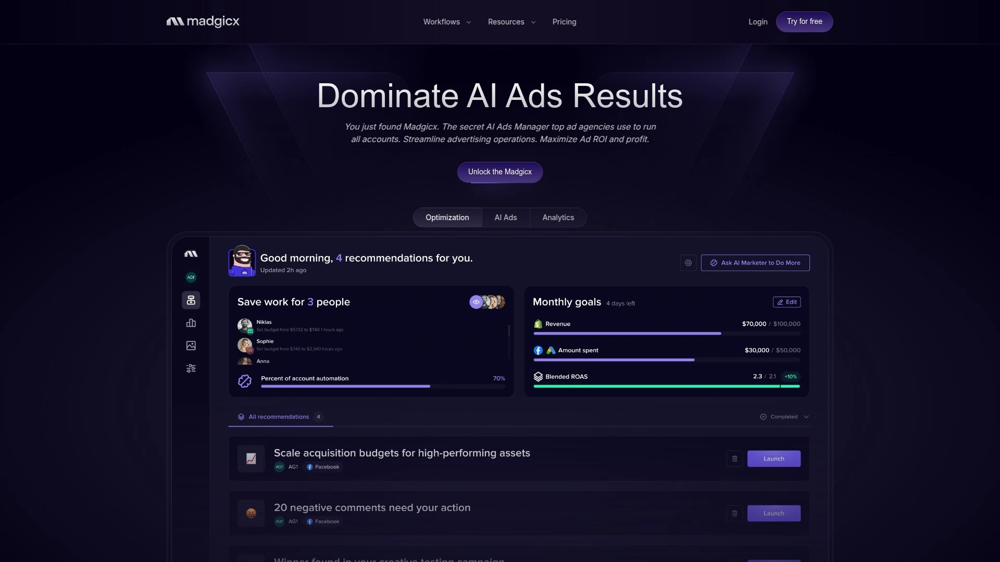

Madgicx delivers end-to-end advertising intelligence combining creative generation, performance analytics, and campaign optimization within one platform. The Meta Ad Library contains over one million inspiring ads that inform AI generation, letting you create new ads based on proven examples and written briefs. Creative performance analytics identify which ad elements drive conversions, revealing opportunities to improve ROAS.

Platform features extend beyond analytics to include campaign optimization, audience targeting, and budget management across Meta and Google channels. AI image modification and unlimited ad generation on higher tiers support rapid creative iteration and testing. Quality of support receives high ratings with dedicated assistance for troubleshooting and optimization guidance.

**Pricing structure** offers multiple tiers accommodating different business sizes, from individual marketers to agencies managing client portfolios. The platform emphasizes taking innovative steps rather than single incremental improvements, encouraging systematic creative testing. Madgicx particularly suits advertisers wanting integrated tools covering creative development through performance tracking rather than point solutions.

Comparison with competitors shows Madgicx provides more comprehensive features including ad inspiration libraries and performance analytics that some alternatives lack. Users appreciate the depth of information available about ad performance, though manual analysis may be required for some optimization decisions.

## **[WASK](https://blog.wask.co)**

All-in-one platform combining AI ad creation, optimization, and competitor analysis.

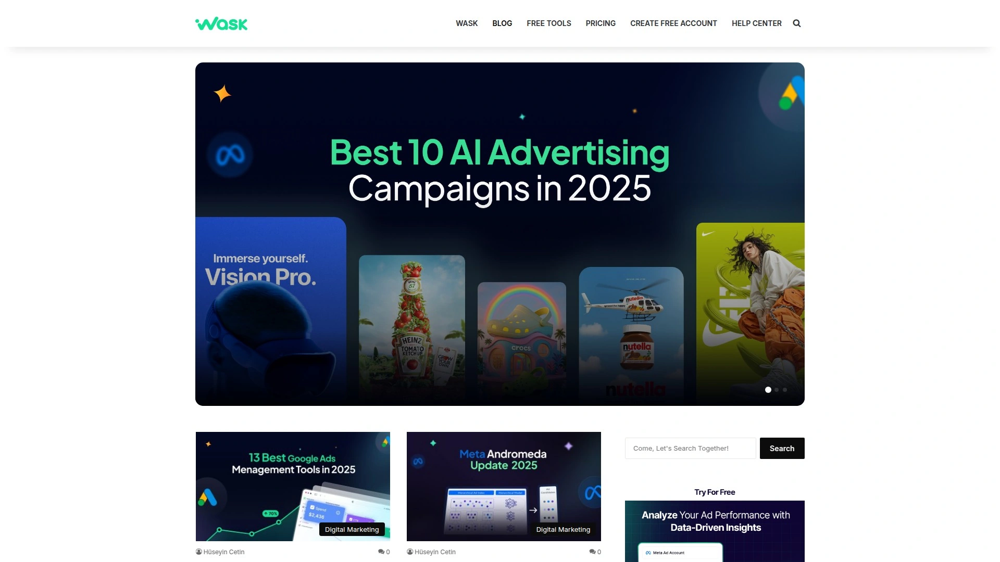

WASK unifies AI ad creative generation, campaign optimization, and competitor analysis in single platform addressing multiple marketing needs. Generate images and videos in seconds using website URLs or text prompts, with fully customizable headlines and CTAs. Creative Analyze module provides CTR and ROAS-based recommendations while the Optimize feature automatically improves budget, bid, and placement strategies.

Performance data from brands using WASK shows up to 8.5× ROAS, 29% more sales, 3.6% higher CTR, and 2.8× more leads through platform-driven optimization. AI Marketing Agent generates custom reports and strategic recommendations tailored to your campaigns. The platform costs from $29 monthly with seven-day free trial, positioning as affordable comprehensive solution.

**User interface** prioritizes simplicity and understandability compared to more complex competitors, reducing learning curve for new users. Smart optimization feature automatically optimizes underperforming ads with one click rather than requiring manual intervention. The 15-day free trial exceeds industry standard, giving users more time to evaluate fit before committing.

WASK particularly suits small to medium businesses wanting comprehensive advertising tools without enterprise complexity or pricing. The platform provides viable alternative to more expensive competitors while delivering core functionality most advertisers require daily.

## **[AdCreative.ai](https://adcreative.ai)**

Conversion-focused platform generating ready-to-launch ad variants at scale.

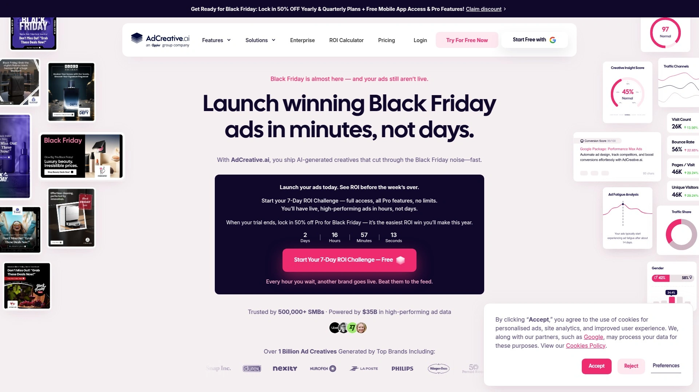

AdCreative.ai produces ad creatives for images and videos optimized specifically for conversions rather than just visual appeal. URL scanning automatically generates copy tailored to brand voice and required ad sizes, reducing manual work. Case studies report up to 14× higher CTR and conversions compared to manually-created ads, making it popular among SMEs and agencies.

Data-backed scoring evaluates creative quality before launch, predicting performance based on historical patterns and machine learning models. Direct integrations with Google and Meta campaigns plus API for programmatic generation support large-scale workflows. Multi-size outputs automatically adapt creative to different placements and formats required across platforms.

**Pricing tiers** range from $39 monthly Starter plan supporting individuals to $599 Ultimate plan for agencies managing multiple client accounts. Enterprise custom pricing accommodates organizations requiring unlimited brands and dedicated support. The platform emphasizes speed—producing variants in seconds rather than hours of designer time.

AdCreative.ai benefits teams prioritizing rapid creative testing over artistic perfection, particularly performance marketers needing volume to find winners. Integration perks with major ad platforms streamline workflow from generation through campaign launch.

## **[Omneky](https://omneky.com)**

Enterprise AI creative platform with predictive analytics and brand consistency enforcement.

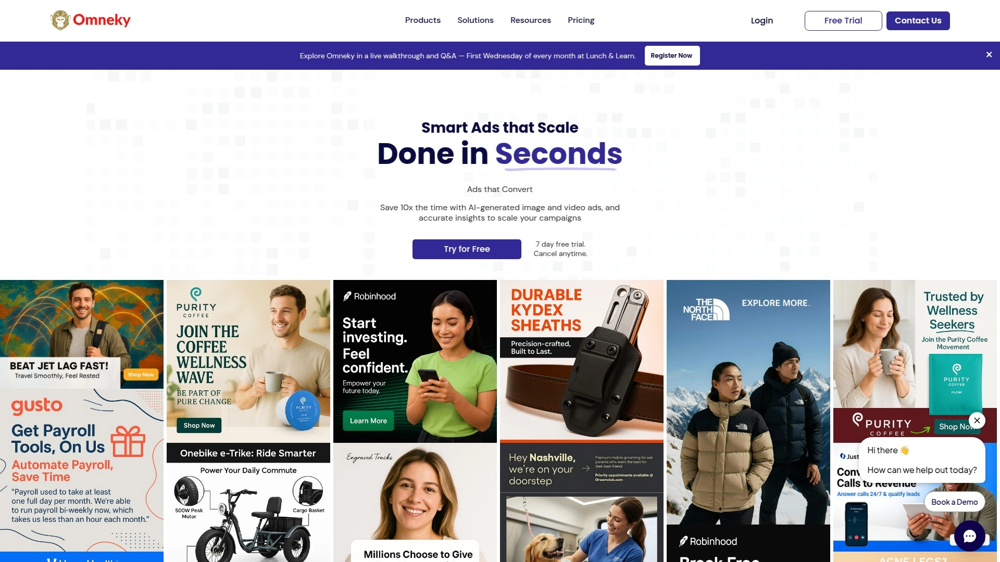

Omneky targets enterprises needing scalable data-driven advertising that maintains brand voice and guidelines across all campaigns. Brand LLM system enforces consistency ensuring every generated creative aligns with established brand standards. Platform produces image and video creatives with bulk variation capabilities and instant resizing for different formats and placements.

Smart Ads and Insights suite integrates real-time performance data with predictive analytics that forecast CTR, ROAS, and conversions before spending budgets. Cross-platform publishing spans Meta, Google, YouTube, TikTok, LinkedIn, Reddit, Snapchat enabling true omnichannel campaigns. Predictive scoring identifies high-performing creatives before launch, reducing wasted spend on underperformers.

**Advanced workflow tools** include template libraries, PSD importer, ad editor, and campaign launcher consolidating creative production pipeline. Creative Generation Pro plan starts at $79 monthly while Pro plus Insights tier adds predictive capabilities for $158 monthly. Enterprise plans offer unlimited brands, API integrations, and advanced AI customization for large-scale operations.

Omneky suits organizations requiring both creative volume and stringent brand control, particularly those managing campaigns across many channels simultaneously. The platform's predictive capabilities provide edge for teams optimizing spend efficiency across large budgets.

## **[Pencil](https://trypencil.com)**

AI ad generator learning from your performance data to improve creative recommendations.

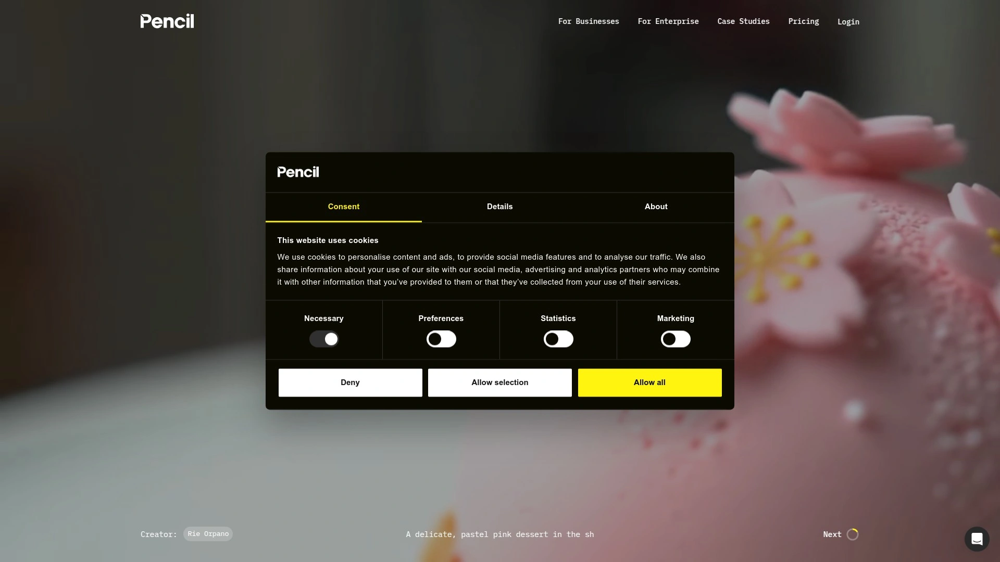

Pencil generates ad variations based on what actually works in your campaigns rather than generic templates. The platform learns from performance data over time, improving recommendations as it understands your brand's unique creative patterns. AI-powered generation creates multiple variants for testing, accelerating the iteration cycle from concept to live ad.

Creative generation focuses on producing ads optimized for specific marketing objectives whether awareness, engagement, or conversions. Platform integration connects to major ad networks enabling seamless workflow from generation through campaign launch and performance tracking. The system particularly benefits brands running continuous creative testing programs where volume matters.

**Pricing accessibility** makes Pencil viable for growing businesses not ready for enterprise platforms but needing more capability than basic design tools. The platform emphasizes learning loops where performance data directly informs next creative iterations. Pencil suits teams comfortable with AI-augmented creative workflows rather than traditional designer-led processes.

## **[Mesha](https://www.mesha.io)**

Creative performance tracking platform automating metrics collection and trend identification.

Mesha automatically gathers performance data from Meta and Google, categorizing creatives by variations like hook, CTA, and format. The platform enables identifying trends showing which specific creative elements consistently deliver positive results. Teams producing over ten creatives weekly across platforms benefit from automation that replaces overwhelming spreadsheet tracking.

Creative categorization organizes ads by systematic variations, making it clear which approaches work across different contexts. Automated data collection eliminates manual export and organization work that consumes hours weekly. The platform particularly helps teams scaling creative production who need better infrastructure than manual tracking.

**Pricing at** $99 monthly includes AI creative generation tools alongside performance tracking, delivering multiple capabilities at accessible cost. Teams transitioning from Google Sheets to purpose-built tools find Mesha addresses specific creative performance needs. The platform suits growing brands producing substantial creative volume requiring systematic tracking.

## FAQ

**How do creative analytics platforms differ from standard ad reporting dashboards?**
Standard dashboards show aggregate metrics like spend and conversions while creative analytics platforms analyze specific creative elements—hooks, formats, messaging, visual components—to reveal which parts of ads actually drive performance. AI categorization automates the manual tagging and analysis work that otherwise requires hours in spreadsheets.

**Can these tools analyze ads across multiple platforms simultaneously?**
Most leading platforms sync data from Meta, TikTok, YouTube, and LinkedIn into unified dashboards, letting you compare creative performance across channels rather than switching between separate ad managers. Cross-platform analysis reveals whether specific creative approaches work universally or perform better on particular channels.

**Are creative analytics platforms worth it for smaller advertising budgets?**
Several platforms offer free tiers or affordable entry pricing under $100 monthly, making advanced analytics accessible beyond enterprise budgets. Even small teams benefit from understanding which creative elements work since optimizing a few ads can significantly improve ROAS regardless of total spend.

## Unlock Your Winning Creative Patterns

Creative analytics platforms transform guesswork into data-driven creative strategy by revealing exactly which ad elements drive your conversions. [Motion](https://motionapp.com) excels for DTC brands and agencies managing substantial ad spend across Meta, TikTok, YouTube, and LinkedIn who need AI-powered insights identifying winning patterns before competitors, with frame-by-frame video analysis and expert-built agents that turn performance data into clear next steps. Choose platforms matching your workflow priorities whether pure analytics, integrated creative production, or combined intelligence and optimization tools, then let AI surface the creative patterns currently buried in your campaign data.
